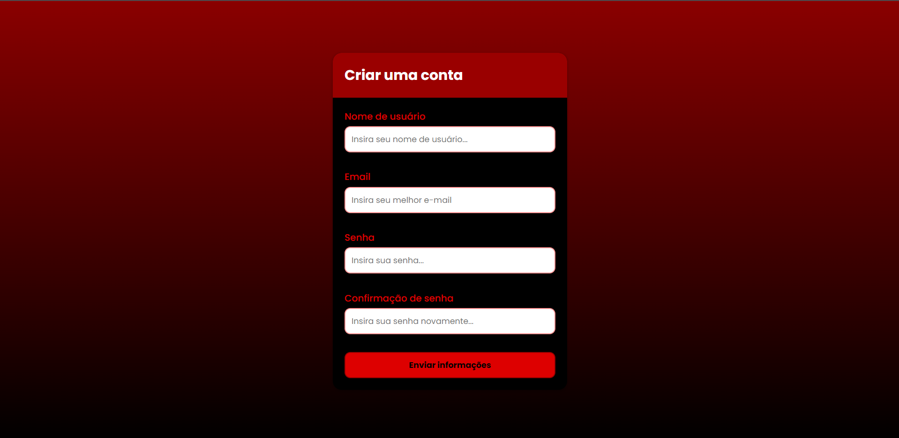
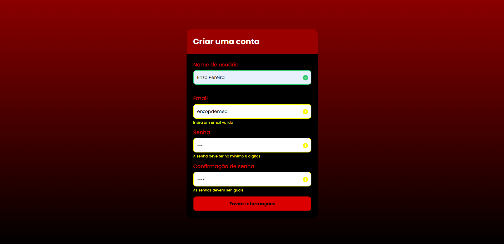

Nesse projeto, criei um formulário que retorna ao usuário uma resposta com erro ou confirmação de dados dentro de inputs. Também é um projeto com responsividade para todas as plataformas, utilizando HTML, CSS e JavaScript.

- Link para acessar o site online: https://fantastic-lily-5059d1.netlify.app

<!-- Sumário -->

## Sumário

- [Visualização](#vizualização)
  - [Tecnologias](#tecnologias)
- [Contato](#contato)

<!-- First view -->

## Visualização

##### First view

##### Response

### Tecnologias

- HTML
- CSS
- JavaScript

## Contato

- GitHub [@enzopdm](https://github.com/enzopdm)
- LinkedIn [@EnzoPereira](https://www.linkedin.com/in/enzo-pereira-a5001a221/)
